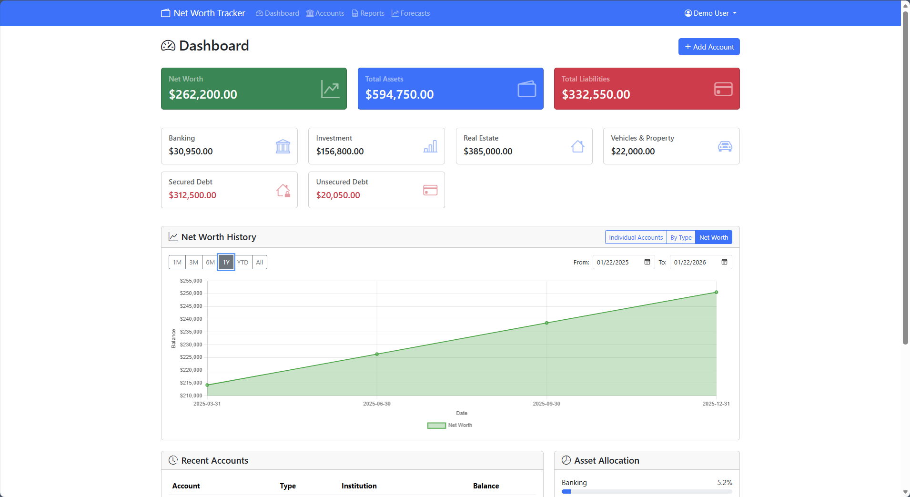
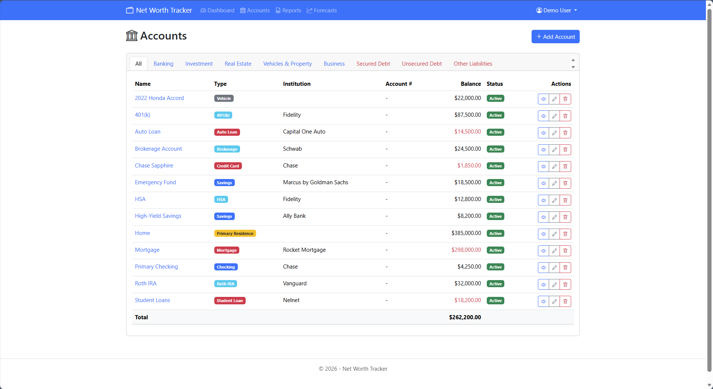
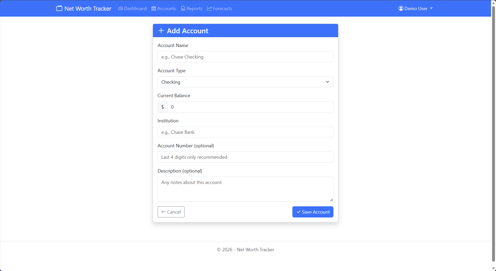
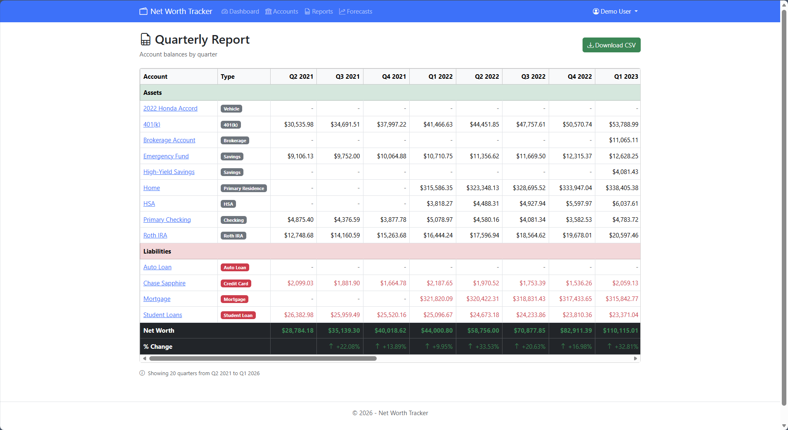
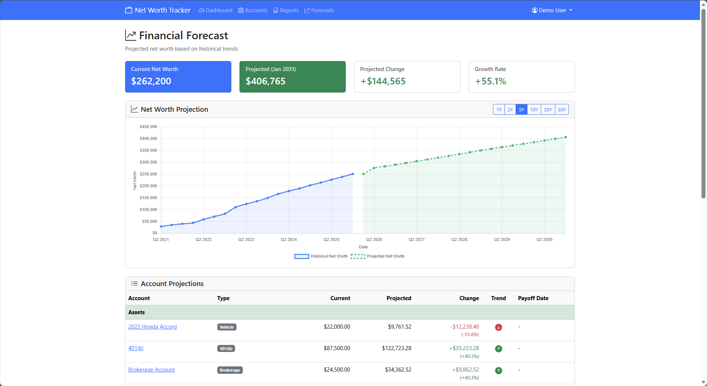
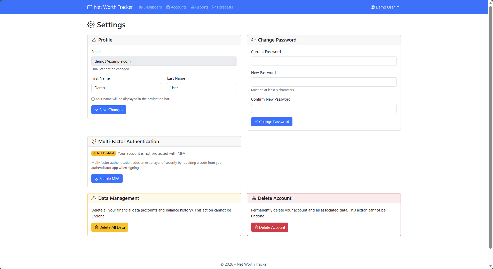

# Net Worth Tracker

A distinguished, self-hosted application for the discerning individual who values both privacy and a clear view of their financial standing. Track your assets, liabilities, and accounts without surrendering your data to third parties.



## Philosophy

Your financial data is deeply personal. This application was built on the principle that tracking your wealth should not require connecting to banks, sharing data with corporations, or trusting cloud services with your most sensitive information. Everything stays on your server, under your control.

## Features

- **Complete Privacy** - Your financial data remains entirely on your server. No bank connections, no data sharing, no tracking, no telemetry.
- **Comprehensive Account Support** - Track checking, savings, investments, retirement accounts, real estate, vehicles, credit cards, loans, and more.
- **Historical Perspective** - Visualize your net worth trajectory over time with elegant, interactive charts.
- **Asset Allocation** - Understand how your holdings are distributed across account categories.
- **Quarterly Reports** - Generate detailed quarterly reports with CSV export for thorough record-keeping.
- **Financial Projections** - Forecast your net worth using compound growth principles with horizons from 1 to 30 years.
- **Multi-Factor Authentication** - Secure your account with TOTP-based MFA using any authenticator app.
- **Multi-User Support** - Each user maintains their own isolated financial records.
- **Effortless Deployment** - Deploy in moments with Docker Compose.
- **Lightweight Architecture** - Uses SQLite by default; no external database required.

## Design

The interface draws inspiration from the timeless elegance of financial publications like The Wall Street Journal, featuring a refined color palette of forest greens, antique golds, and cream backgrounds. Typography is handled by Libre Baskerville, a serif typeface that conveys stability and sophistication.

## Quick Start

### Using Docker Compose (Recommended)

1. Create a `docker-compose.yml` file:

```yaml
services:
  web:
    image: ghcr.io/aaron-lee-hebert/net-worth-tracker:latest
    ports:
      - "8080:8080"
    volumes:
      - networth-data:/app/data
    environment:
      - ASPNETCORE_ENVIRONMENT=Production

volumes:
  networth-data:
```

2. Start the application:

```bash
docker compose up -d
```

3. Open http://localhost:8080 in your browser and create an account.

### Building from Source

Prerequisites:

- [.NET 9 SDK](https://dotnet.microsoft.com/download/dotnet/9.0)
- [Docker](https://www.docker.com/) (optional)

```bash
# Clone the repository
git clone https://github.com/aaron-lee-hebert/net-worth-tracker.git
cd net-worth-tracker

# Build and run with Docker
docker compose up -d --build

# Or run directly with .NET
cd src/NetWorthTracker.Web
dotnet run
```

## Screenshots

<details>
<summary>View application screenshots</summary>

### Dashboard


### Accounts



### Add Account



### Quarterly Reports



### Financial Projections



### Settings



</details>

## Administration

### CLI Commands

The application includes administrative commands for user management:

```bash
# Display available commands
dotnet NetWorthTracker.Web.dll --help

# List all registered users
dotnet NetWorthTracker.Web.dll --list-users

# Reset a user's password
dotnet NetWorthTracker.Web.dll --reset-password user@example.com NewPassword123
```

**Docker usage:**

```bash
# List users
docker exec -it <container-name> dotnet NetWorthTracker.Web.dll --list-users

# Reset password
docker exec -it <container-name> dotnet NetWorthTracker.Web.dll --reset-password user@example.com NewPassword123
```

Password requirements:
- Minimum 8 characters
- At least one uppercase letter
- At least one lowercase letter
- At least one digit

## Configuration

### Environment Variables

| Variable                               | Description                                  | Default                             |
| -------------------------------------- | -------------------------------------------- | ----------------------------------- |
| `ASPNETCORE_ENVIRONMENT`               | Environment mode                             | `Production`                        |
| `DatabaseProvider`                     | Database type (`SQLite` or `PostgreSQL`)     | `SQLite`                            |
| `ConnectionStrings__DefaultConnection` | Database connection string                   | `Data Source=/app/data/networth.db` |
| `SeedDemoData`                         | Seed database with demonstration data        | `false`                             |

### Demonstration Mode

To explore the application with sample data, enable demo seeding:

```yaml
services:
  web:
    image: ghcr.io/aaron-lee-hebert/net-worth-tracker:latest
    ports:
      - "8080:8080"
    volumes:
      - networth-data:/app/data
    environment:
      - SeedDemoData=true

volumes:
  networth-data:
```

This creates a demonstration account with five years of sample financial history:

- **Email**: `demo@example.com`
- **Password**: `DemoPassword123`

The demonstration account includes a realistic portfolio: checking, savings, 401(k), Roth IRA, HSA, brokerage, home equity, mortgage, auto loan, student loans, and credit card—all with quarterly balance history.

### Using PostgreSQL

For production deployments or multi-user scenarios, PostgreSQL provides additional robustness:

```yaml
services:
  web:
    image: ghcr.io/aaron-lee-hebert/net-worth-tracker:latest
    ports:
      - "8080:8080"
    depends_on:
      db:
        condition: service_healthy
    environment:
      - DatabaseProvider=PostgreSQL
      - ConnectionStrings__DefaultConnection=Host=db;Port=5432;Database=networth;Username=networth;Password=your-secure-password

  db:
    image: postgres:17-alpine
    environment:
      - POSTGRES_USER=networth
      - POSTGRES_PASSWORD=your-secure-password
      - POSTGRES_DB=networth
    volumes:
      - postgres-data:/var/lib/postgresql/data
    healthcheck:
      test: ["CMD-SHELL", "pg_isready -U networth -d networth"]
      interval: 5s
      timeout: 5s
      retries: 5

volumes:
  postgres-data:
```

PostgreSQL uses snake_case naming conventions for tables and columns (e.g., `balance_histories`, `created_at`).

## Financial Projections

The Forecasts page projects your future net worth using compound growth principles. Projections are available for 1, 2, 5, 10, 20, and 30 year horizons.

### Growth Assumptions

| Account Type    | Annual Rate      | Rationale                                            |
| --------------- | ---------------- | ---------------------------------------------------- |
| Investments     | 7% growth        | Historical average for diversified equity portfolios |
| Real Estate     | 2% appreciation  | Conservative estimate at or below inflation          |
| Banking/Savings | 0.5% growth      | Minimal interest assumption                          |
| Business        | 3% growth        | Conservative business growth                         |
| Vehicles        | 15% depreciation | Floor at 10% of original value (salvage)             |
| Liabilities     | Paydown to $0    | Uses historical rate or 3% quarterly minimum         |

All projections use compound interest where each period builds upon the previous balance. Per the Rule of 72, investments growing at 7% annually will approximately double every ten years.

These projections are estimates for informational purposes only and should not be construed as financial advice.

## Technical Foundation

- **Backend**: ASP.NET Core 9, NHibernate, FluentNHibernate
- **Frontend**: Razor Pages, Bootstrap 5, Chart.js
- **Database**: SQLite (default) or PostgreSQL
- **Authentication**: ASP.NET Core Identity with MFA support
- **Typography**: Libre Baskerville

## Data Storage

All data resides in a SQLite database file at `/app/data/networth.db` inside the container. Mount a volume to persist data across container restarts.

Your data never leaves your server. There are no external API calls, analytics, or telemetry.

## Contributing

Contributions are welcome. Please see [CONTRIBUTING.md](CONTRIBUTING.md) for guidelines.

## Support

If you find this project valuable, consider supporting its continued development:

[](https://www.buymeacoffee.com/aaronleehebert)

## License

This project is licensed under the MIT License. See the [LICENSE](LICENSE) file for details.

## Acknowledgments

- [ASP.NET Core](https://docs.microsoft.com/en-us/aspnet/core/)
- [NHibernate](https://nhibernate.info/)
- [Bootstrap](https://getbootstrap.com/)
- [Chart.js](https://www.chartjs.org/)
- [Libre Baskerville](https://fonts.google.com/specimen/Libre+Baskerville)
